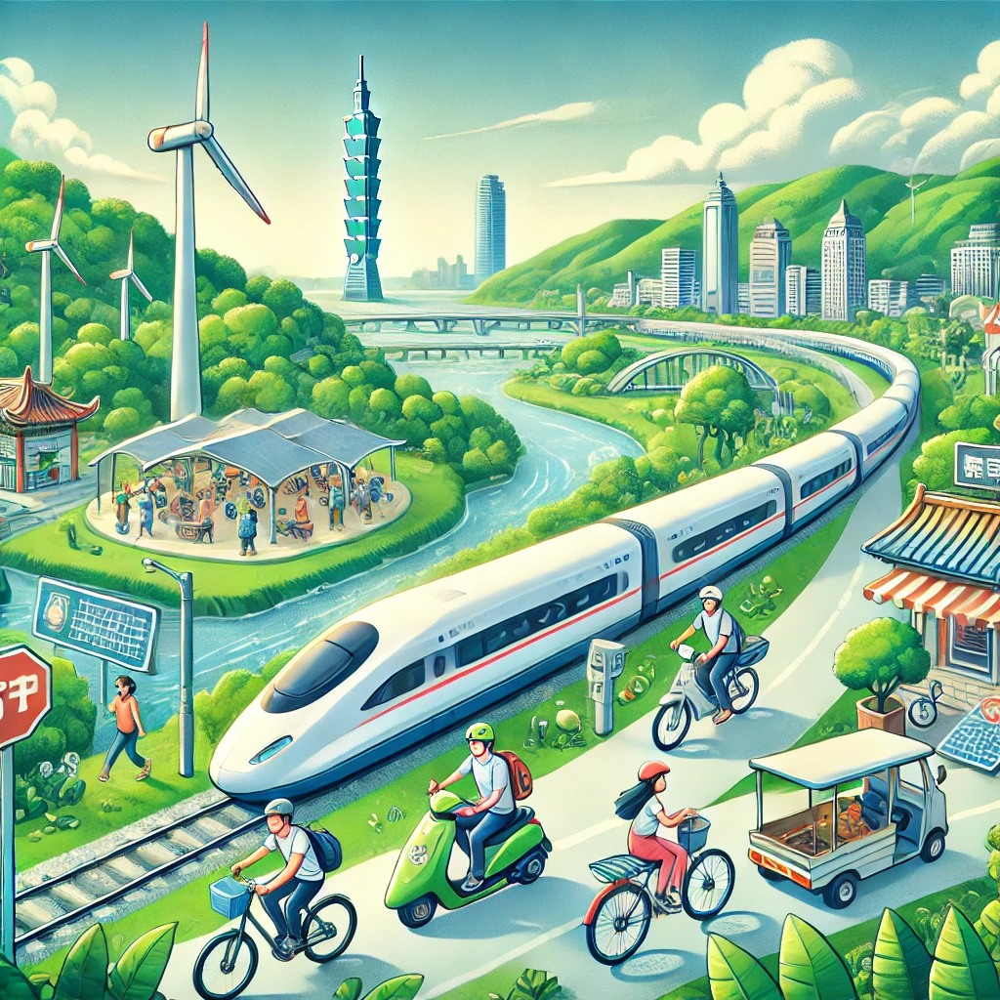

# 旅遊減碳
## 1. 旅遊業減碳的全球趨勢與現狀

**介紹全球旅遊業的減碳挑戰與現狀，探討各國如何應對氣候變遷並推動綠色旅遊。**
- 旅遊業*碳排放*現狀
- **氣候**變遷對旅遊業的影響
- ***國際協議***與減碳目標
- 政府政策與<ins>綠色旅遊</ins>倡議
- <sub>行業合作</sub>與<sup>創新解決</sup>方案
## 2. 減碳目標：旅遊業的責任與挑戰
闡述旅遊業面對的減碳責任，\
以及航空、\
交通和住宿業所需克服的主要挑戰。
## 3. 綠色旅遊政策與政府倡議
(空兩格)  
**介紹各國政府的減碳政策，  
如何促進低碳交通、  
綠色住宿和可持續旅遊發展。**  
綠色旅遊政策與政府倡議旨在促進可持續旅遊發展，減少旅遊業對環境的負面影響。各國政府通過`制定減碳政策`、`推動低碳交通`、`提供綠色認證`等措施來支持環保旅遊。此外，政府還鼓勵企業與消費者選擇環保選項，並提供激勳和補助以促進綠色技術與可持續旅遊項目。這些倡議有助於實現旅遊業碳排放的減少與環境保護。
## 4. 企業與消費者：如何共同推動減碳行動？
(空兩段間隔較寬)


探討企業與消費者如何透過選擇環保服務，

協力推動旅遊業減碳。

```
碳吸收量 (kgCO₂)=碳吸收速率 (kgCO₂/年)×樹木數量×年數

碳吸收速率：每棵樹每年吸收的二氧化碳量。
樹木數量：實施碳補償行動所植樹的數量。
```
## 5. 未來旅遊：邁向碳中和的藍圖
展望未來旅遊業如何透過科技創新和行業協作實現碳中和。
